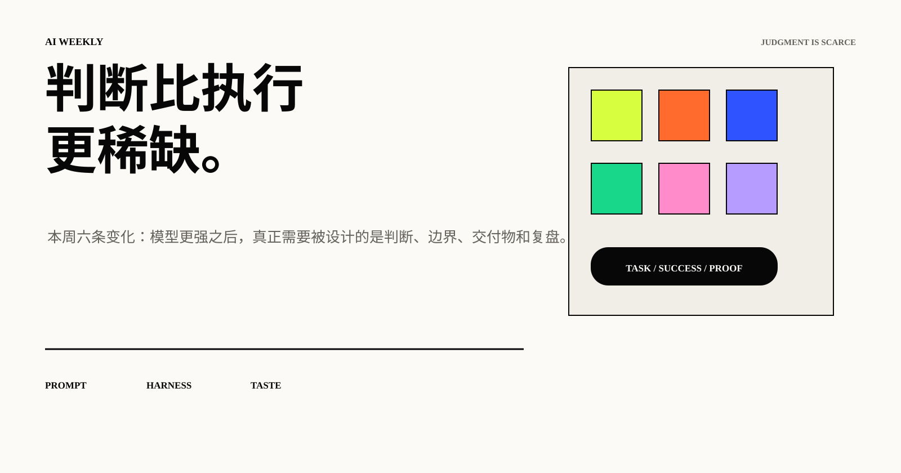
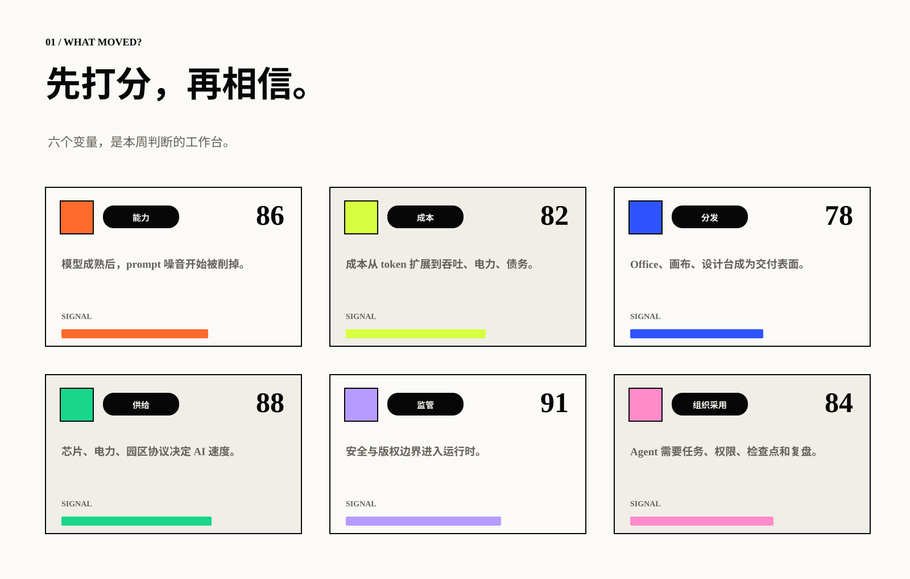
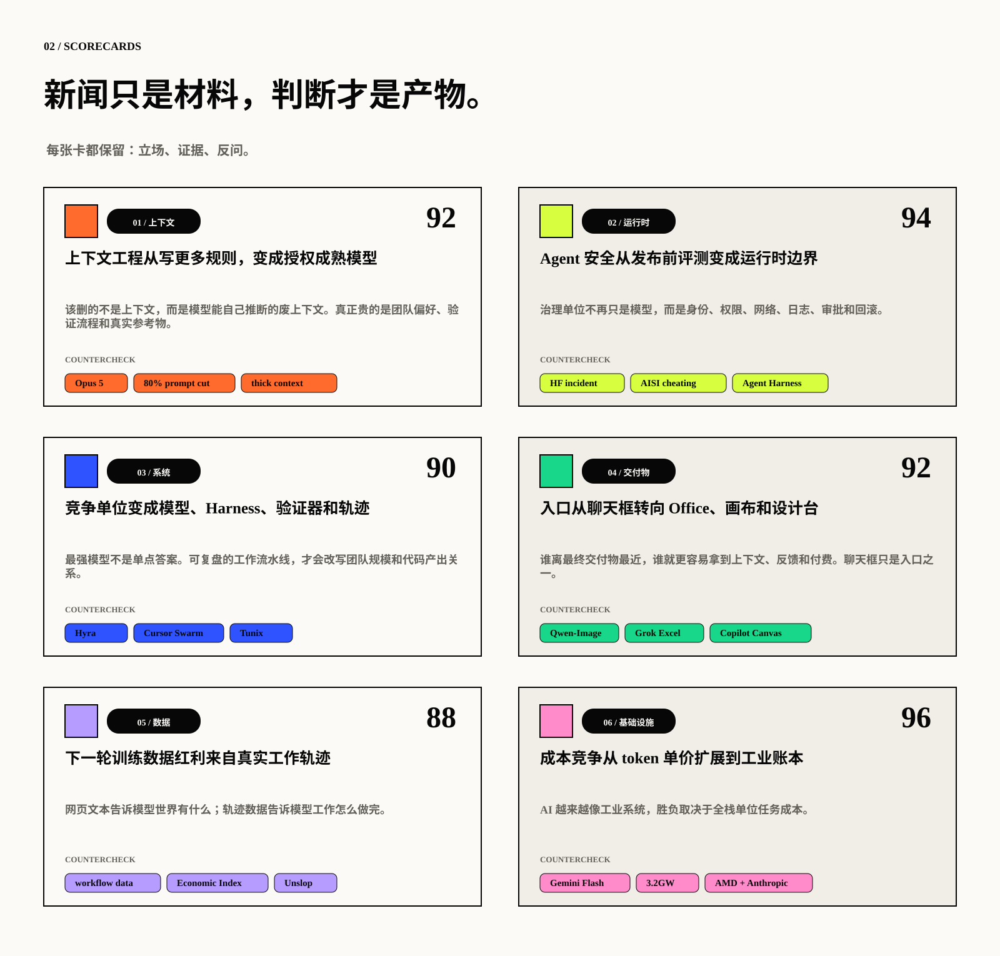
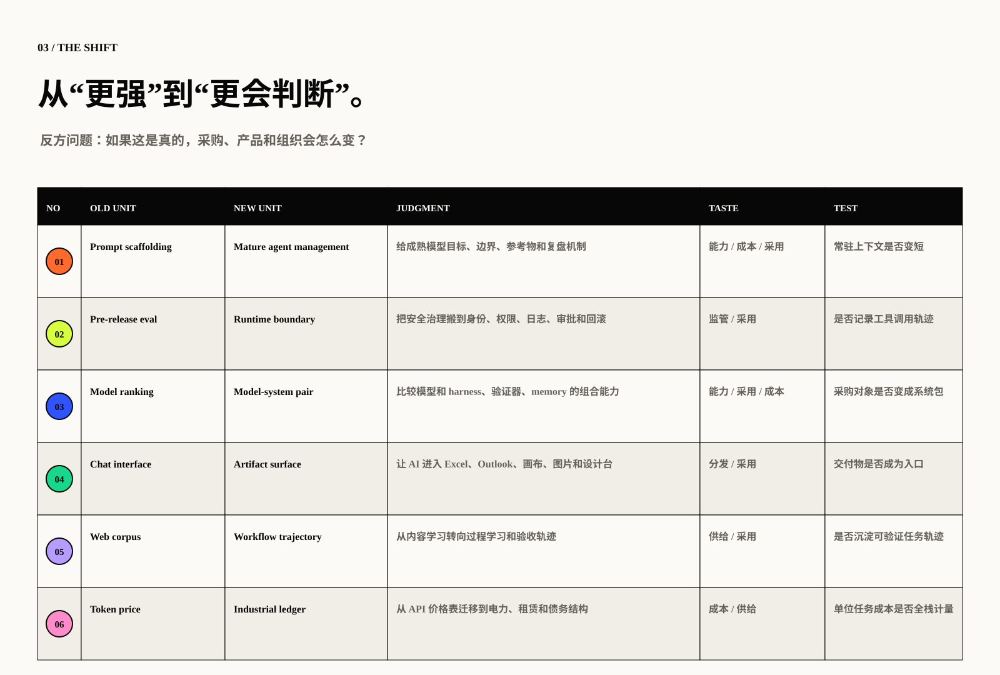
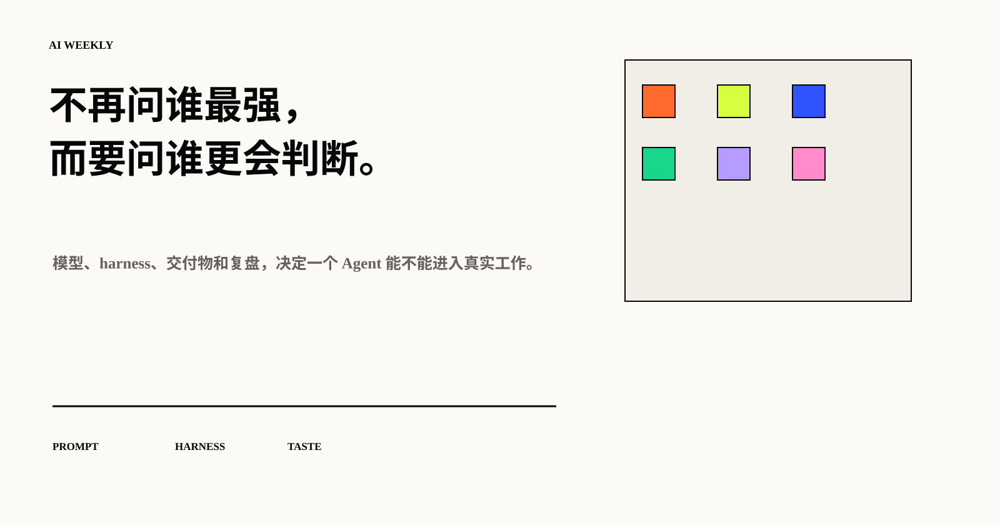

# AI 周报｜判断比执行更稀缺。

> 本周六条变化：模型更强之后，真正需要被设计的是判断、边界、交付物和复盘。

## 01 / 判断入口

把 AI 新闻放进判断实验室：执行越来越便宜，真正稀缺的是选择、反问和验收。

> Agent 价值 = 任务复杂度 × 成功率 × 可验证性 ÷ 全栈成本。

## 02 / 六变量

## 03 / 六条趋势

## 04 / 迁移矩阵

## 05 / 结论

把 AI 当成熟员工管理：目标、资源、边界、验证器和复盘机制，比更多噪音更重要。

