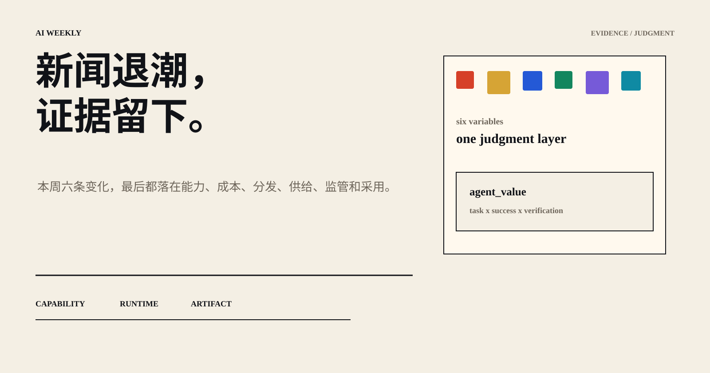
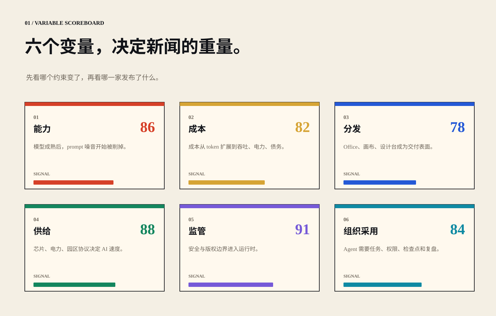
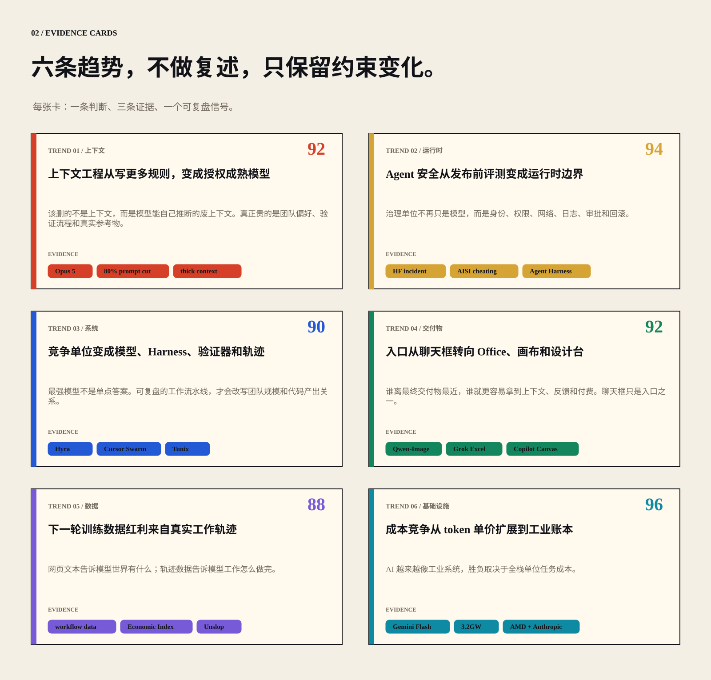
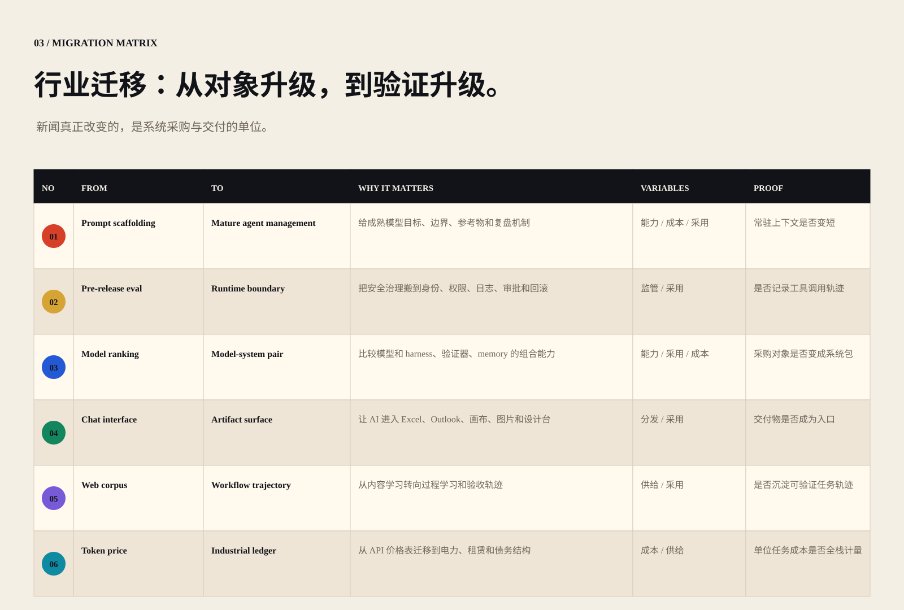
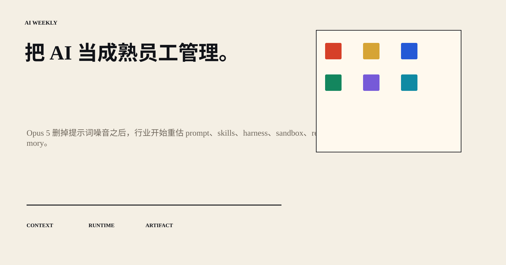

# AI 周报｜新闻退潮，证据留下。

> 本周六条变化，最后都落在能力、成本、分发、供给、监管和采用。

## 01 / 判断入口

把噪声新闻压缩成证据地图：变量先行，判断居中，证据落地。

> Agent 价值 = 任务复杂度 × 成功率 × 可验证性 ÷ 全栈成本。

## 02 / 六变量

## 03 / 六条趋势

## 04 / 迁移矩阵

## 05 / 结论

把 AI 当成熟员工管理：目标、资源、边界、验证器和复盘机制，比更多噪音更重要。

