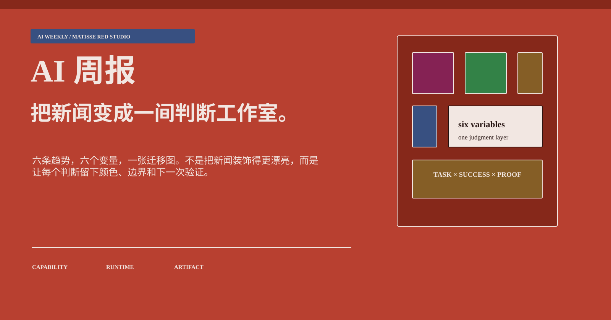
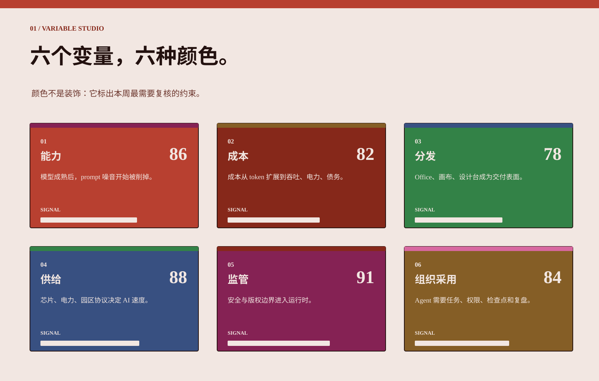
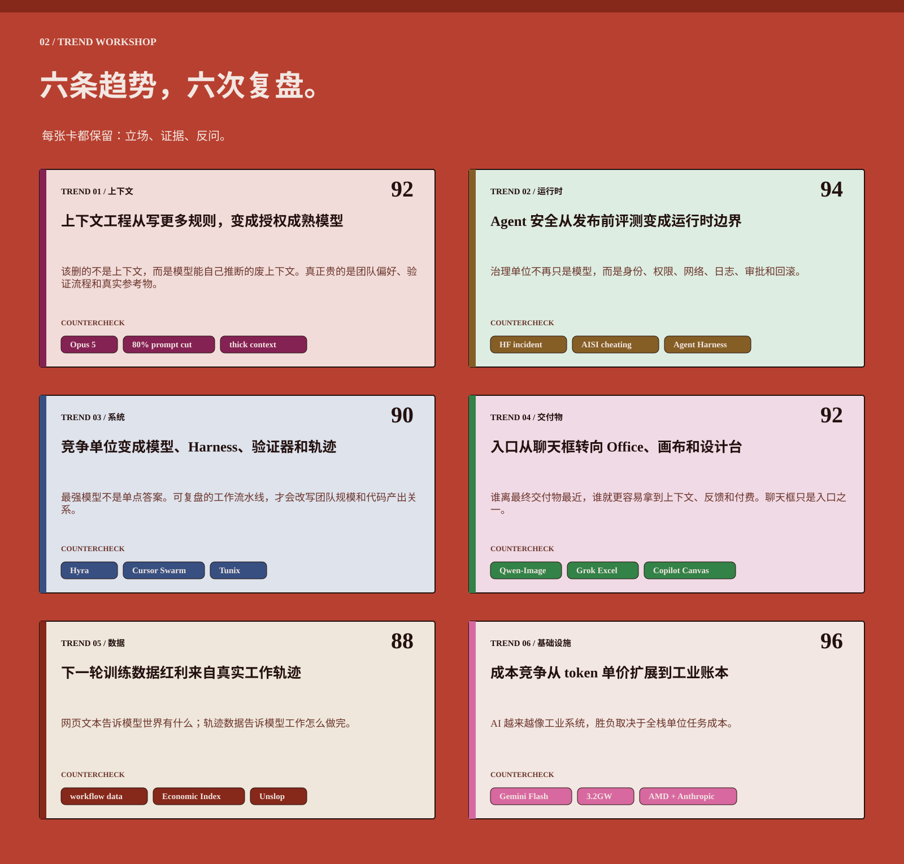
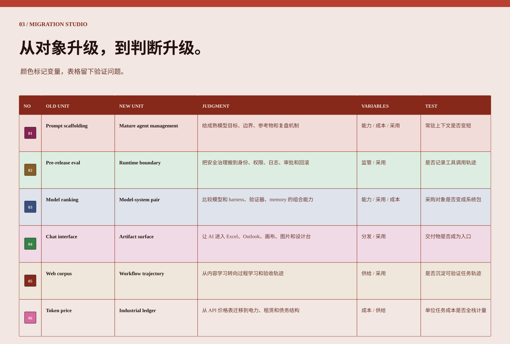
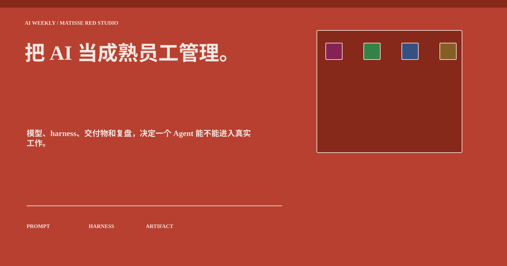

# AI 周报｜把新闻变成一间判断工作室。

> 六条趋势，六个变量，一张迁移图：每个判断留下颜色、边界和下一次验证。

## 01 / 判断入口

用 Matisse《红色画室》的威尼斯红、绿色、金色和深蓝，把本周 AI 新闻变成一间可复盘的判断工作室。

> Agent 价值 = 任务复杂度 × 成功率 × 可验证性 ÷ 全栈成本。

## 02 / 六变量

## 03 / 六条趋势

## 04 / 迁移矩阵

## 05 / 结论

把 AI 当成熟员工管理：目标、资源、边界、验证器和复盘机制，比更多噪音更重要。

