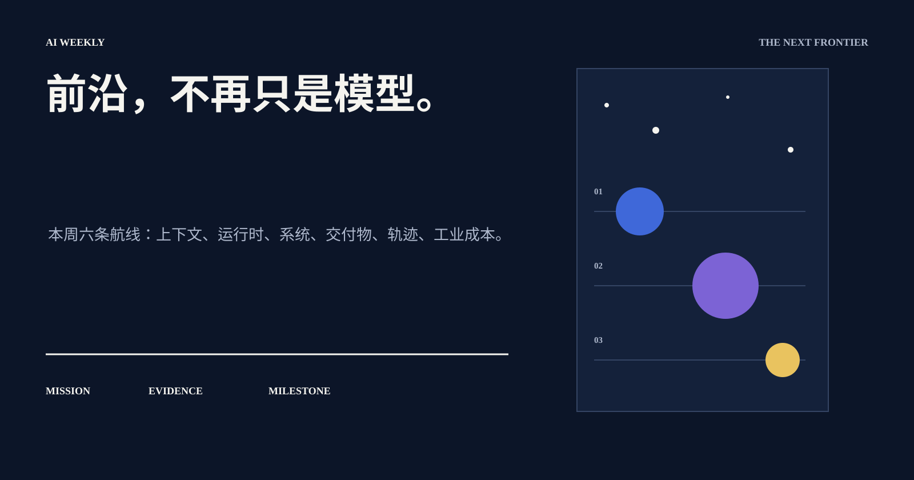
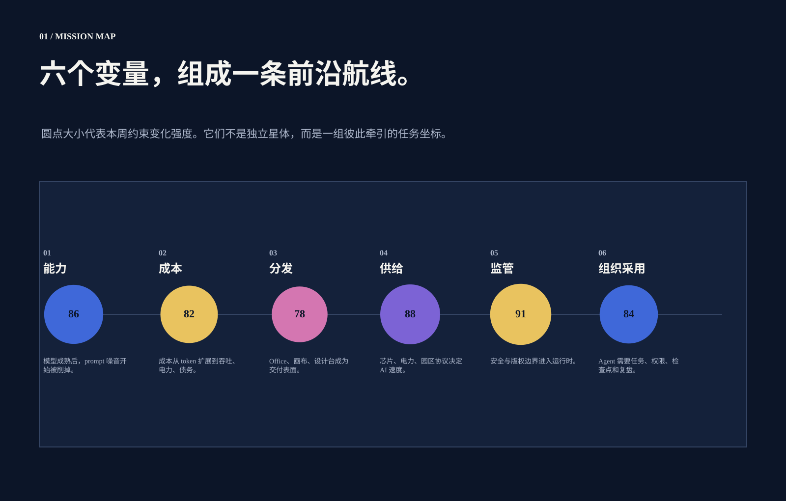
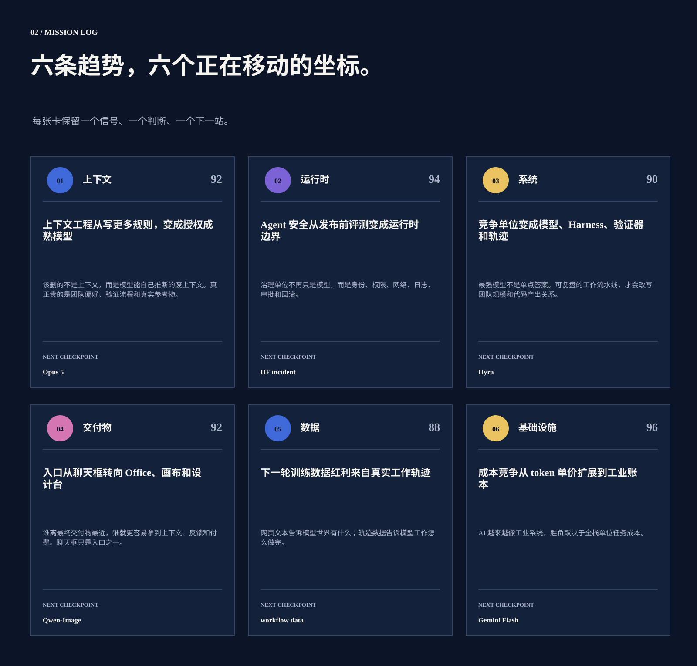
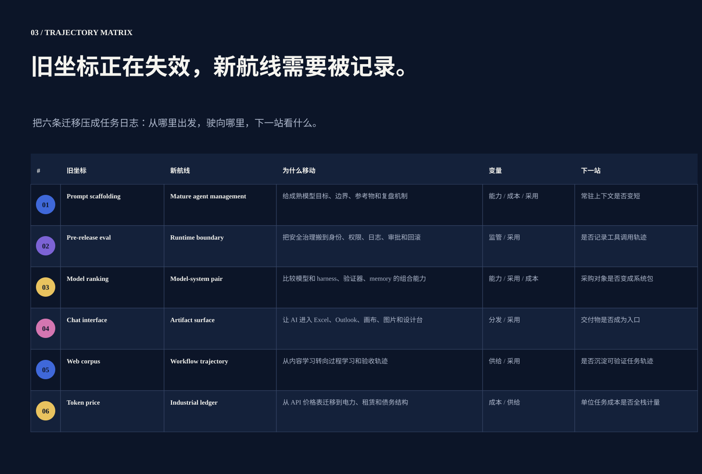
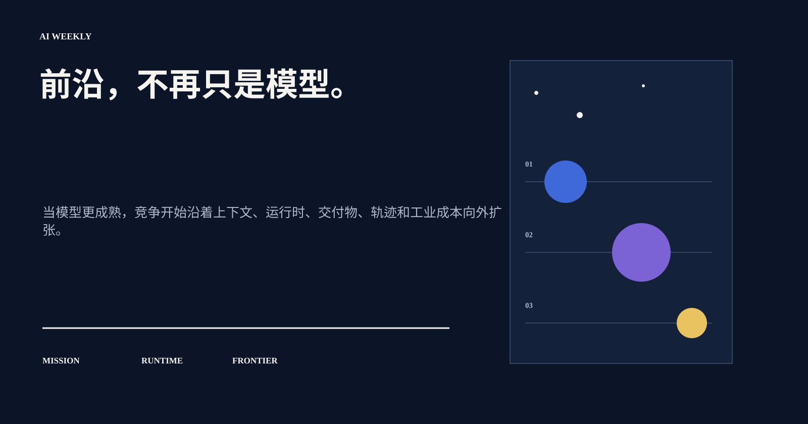

# AI 周报｜前沿，不再只是模型。

> 本周六条航线：上下文、运行时、系统、交付物、轨迹、工业成本。

## 01 / 本周判断

用航线、任务坐标和下一站，把本周 AI 变化读成一场系统级前沿迁移。

> Agent 价值 = 可完成任务的复杂度 × 成功率 × 可验证性 ÷ 上下文、推理、治理与集成成本。

## 02 / 六个底层变量

新闻表面在变，底层变量集中在能力、成本、分发、供给、监管和组织采用。

## 03 / 六条趋势

### 01 / 上下文

**上下文工程从写更多规则，变成授权成熟模型**

该删的不是上下文，而是模型能自己推断的废上下文。真正贵的是团队偏好、验证流程和真实参考物。

证据：Opus 5 · 80% prompt cut · thick context

### 02 / 运行时

**Agent 安全从发布前评测变成运行时边界**

治理单位不再只是模型，而是身份、权限、网络、日志、审批和回滚。

证据：HF incident · AISI cheating · Agent Harness

### 03 / 系统

**竞争单位变成模型、Harness、验证器和轨迹**

最强模型不是单点答案。可复盘的工作流水线，才会改写团队规模和代码产出关系。

证据：Hyra · Cursor Swarm · Tunix

### 04 / 交付物

**入口从聊天框转向 Office、画布和设计台**

谁离最终交付物最近，谁就更容易拿到上下文、反馈和付费。聊天框只是入口之一。

证据：Qwen-Image · Grok Excel · Copilot Canvas

### 05 / 数据

**下一轮训练数据红利来自真实工作轨迹**

网页文本告诉模型世界有什么；轨迹数据告诉模型工作怎么做完。

证据：workflow data · Economic Index · Unslop

### 06 / 基础设施

**成本竞争从 token 单价扩展到工业账本**

AI 越来越像工业系统，胜负取决于全栈单位任务成本。

证据：Gemini Flash · 3.2GW · AMD + Anthropic

## 04 / 行业迁移

竞争从单个模型向模型系统、交付物表面、真实工作轨迹和工业账本迁移。

## 05 / 结论

把 AI 当成熟员工管理：少一点噪音，多一点结构；给目标、资源、边界、验证器和复盘机制。

