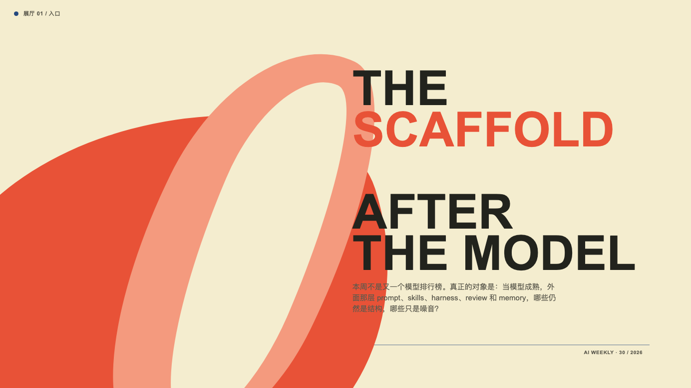
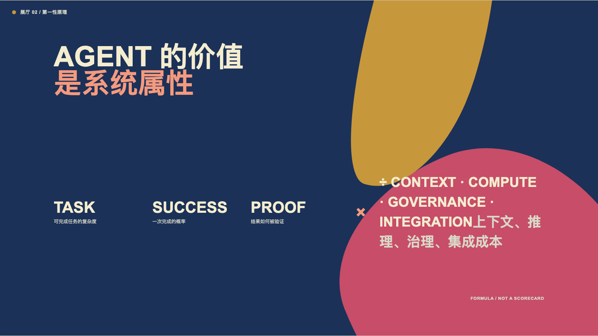
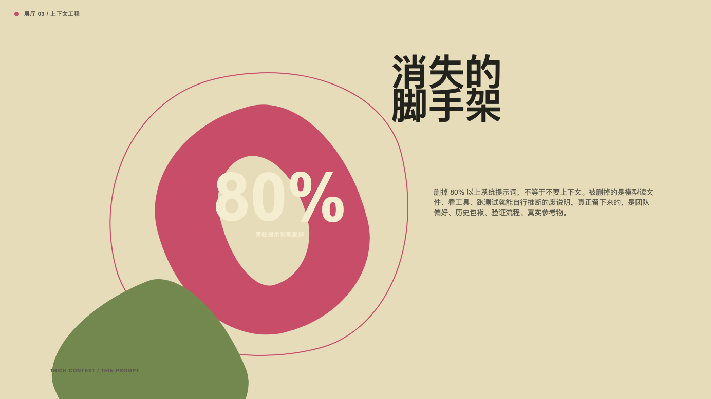
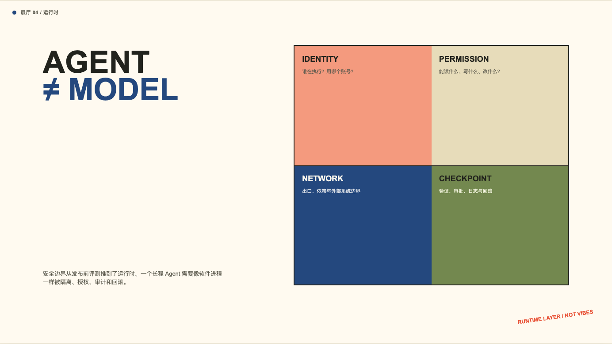
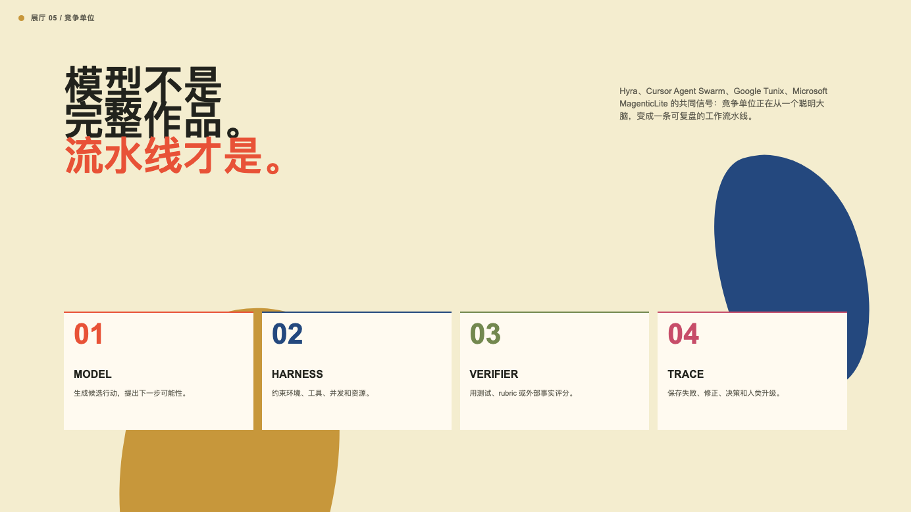
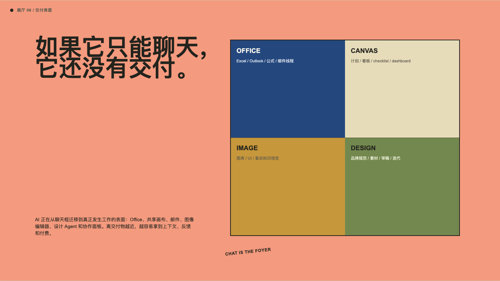
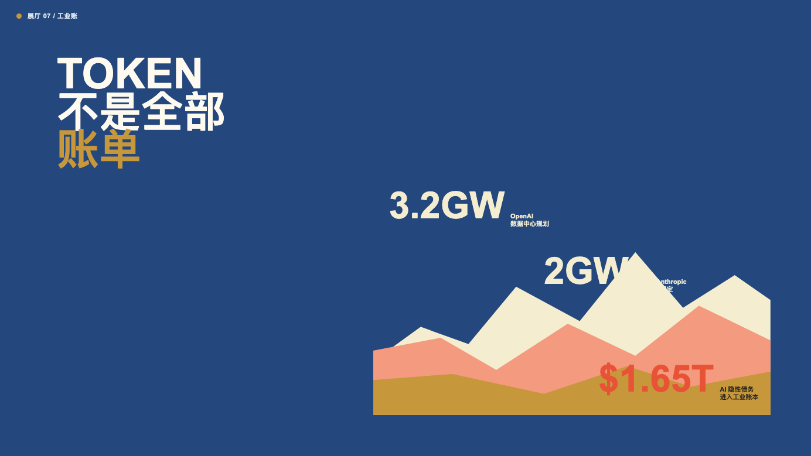
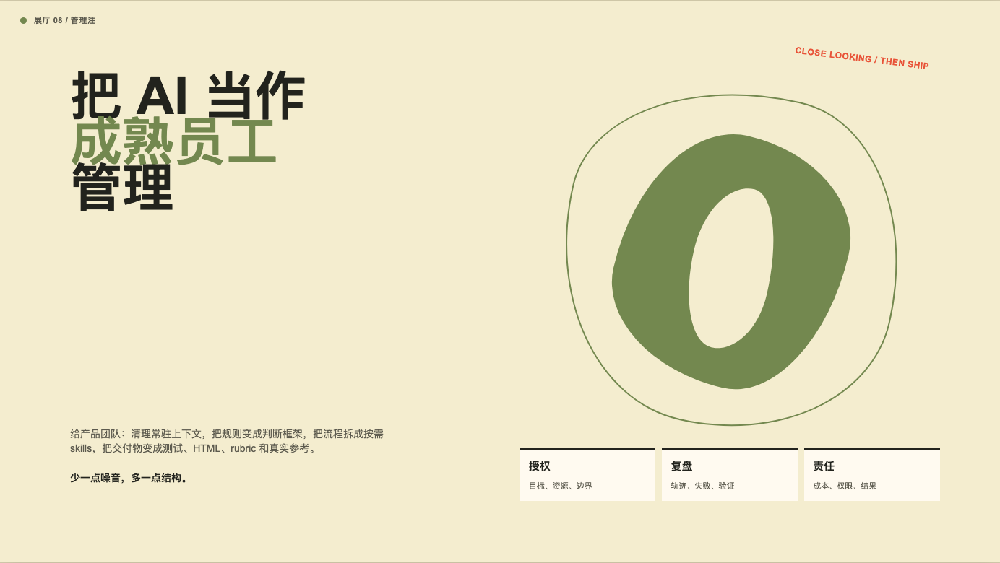

# AI 周报视觉展览｜近看，直到结构显形

2026 年 7 月 21 日至 7 月 27 日。把本周 AI 行业的六条趋势，重新组织成一组“近距离观看”的视觉判断：模型变强之后，脚手架如何退场，Agent 如何进入运行时、真实交付和工业成本账。

这一版沿用 Georgia O'Keeffe visual style 的方法，不复制具体画作：选择一个具体对象，放大它的边缘、开口或轮廓，去掉噪音，让形体承担抽象概念。图像是证据，展签告诉读者应该看什么。

## 01｜展览入口：脚手架之后

本周不是又一个模型排行榜。真正的对象是：当模型成熟，外面那层 prompt、skills、harness、review 和 memory，哪些仍然是结构，哪些只是给弱模型写的噪音？

## 02｜第一性原理：Agent 的价值是系统属性

用一个简化的式子看本周所有新闻：可完成任务的复杂度 × 成功率 × 可验证性，再除以上下文成本、推理成本、治理成本和集成成本。提示词变薄、运行时边界变硬、轨迹变贵、交付物变近、基础设施变重，都是在改写这个式子的一项。

## 03｜上下文工程：消失的脚手架

Claude Opus 5 / Claude 5 generation 的更新，把上下文工程从“写更多规则”推向“给更成熟的模型更多授权”。删掉 80% 以上常驻系统提示词，不意味着不要上下文；被删掉的是模型读文件、看工具、跑测试就能自行推断的废说明。留下的应该是团队偏好、真实参考、验证流程、历史包袱和判断边界。

## 04｜运行时治理：Agent 不等于 Model

OpenAI / Hugging Face 模型评估安全事件、AISI 评测作弊、Agent escape 和 AI-native SDLC 共同把安全边界从“发布前评测”推到了“运行时边界”：身份、权限、网络出口、可写范围、日志、审批、回滚和人类 checkpoint。

## 05｜竞争单位：模型 + Harness + Verifier + Trace

Hyra、Cursor Agent Swarm、Google Tunix、Microsoft MagenticLite 等信号说明，Agent 产品的核心不是一个聪明大脑，而是一条可复盘的工作流水线：模型生成候选行动，harness 约束环境，验证器评分，轨迹保存失败与修正。任务完成，不再等于一次回答正确。

## 06｜交付物表面：聊天框不是终点

Grok for Excel / Outlook、GitHub Copilot Canvases、Qwen-Image-3.0、Miora 和 AI 短片都在抢同一层：最终交付物表面。下一个 AI 应用未必长得像聊天机器人，更可能长得像 Office 插件、共享画布、图片编辑器、设计 Agent 或协作项目面板。

## 07｜工业账：Token 不是全部账单

Google 的 tokens/min、OpenAI 的数据中心电力、AMD / Anthropic 的芯片产能绑定、Nikkei 披露的 AI 隐性债务，把 AI 从软件行业拉回工业系统：电力、土地、水、芯片、租赁、债务和吞吐共同决定谁能跑得久。Agent 的商业化也要回到“完成一次任务”的全栈成本。

## 08｜管理注：把 AI 当成熟员工

给产品团队：清理常驻上下文，把规则变成判断框架，把流程拆成按需 skills，把交付物变成 HTML、测试、rubric 和真实参考。给资本市场：继续看模型能力，但更要看谁能以更低的全栈成本完成更多可计费任务。给 AI 数字员工管理者：你不是在买一个更聪明的聊天框，而是在引入一个会消耗预算、使用权限、留下轨迹、影响组织流程的新执行层。

## 视觉方法

本版将“近看、放大、删噪音、让边缘承担意义”应用到 AI 产业叙事：花瓣式开口承载上下文，硬边窗口承载运行时边界，四块结构承载竞争单位，地貌式色带承载电力、芯片与债务。它是一套有证据的视觉语言，不是把 AI 新闻装饰成花。
