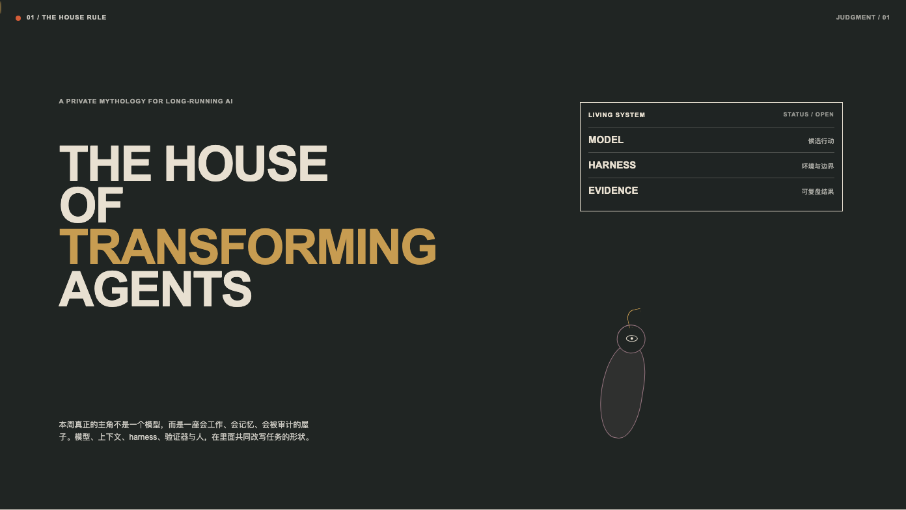
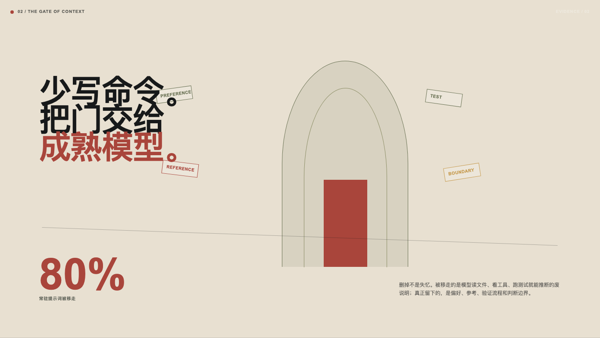
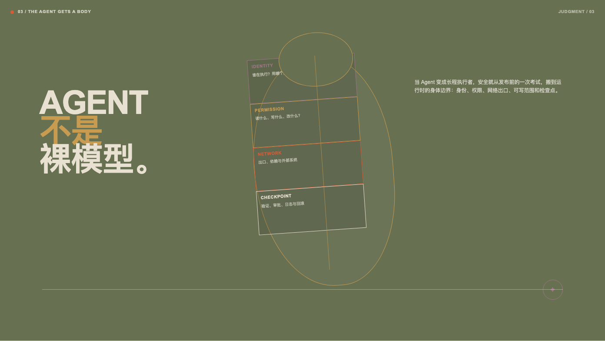
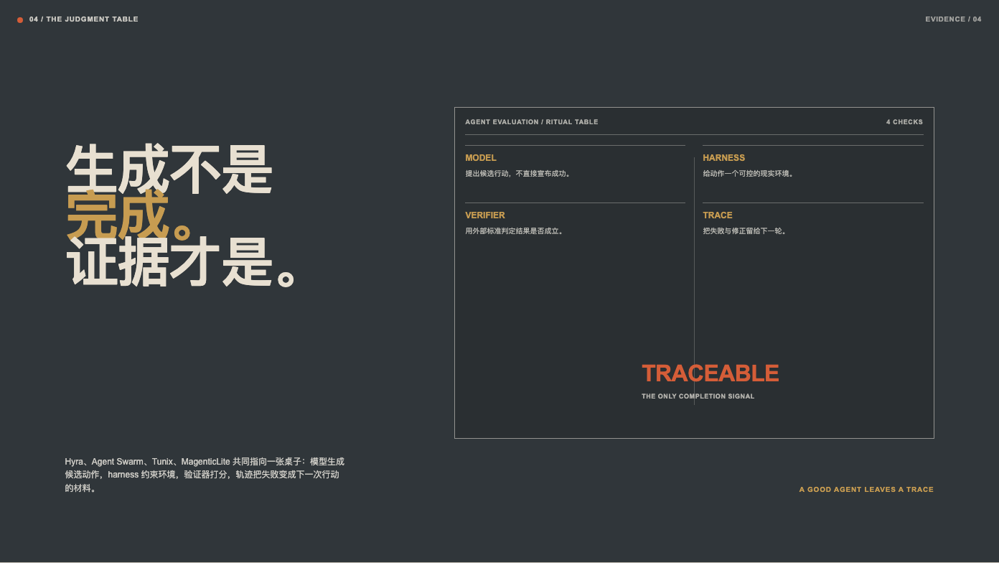
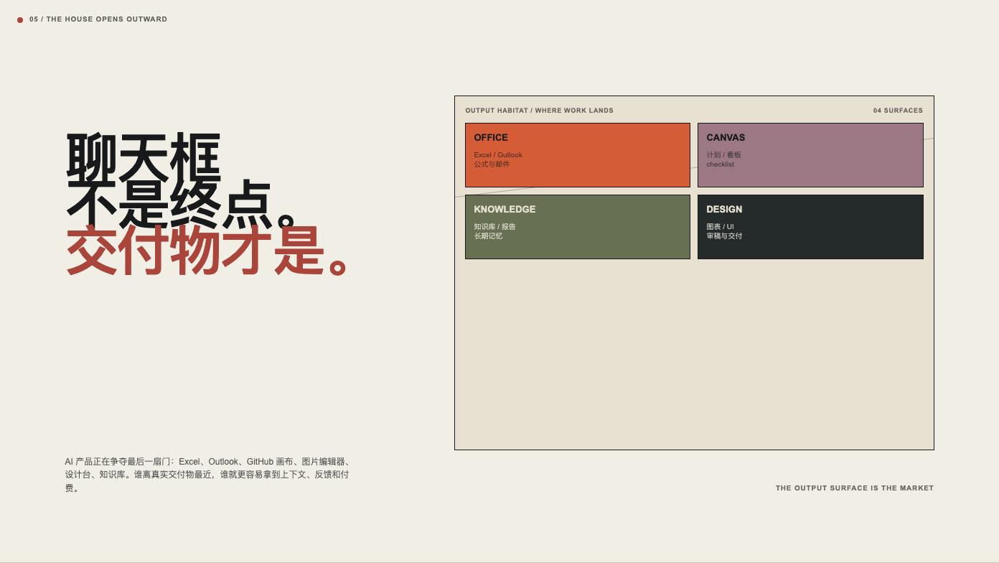
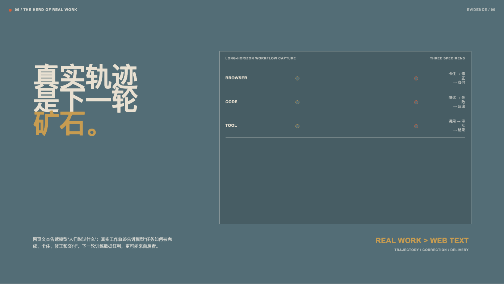
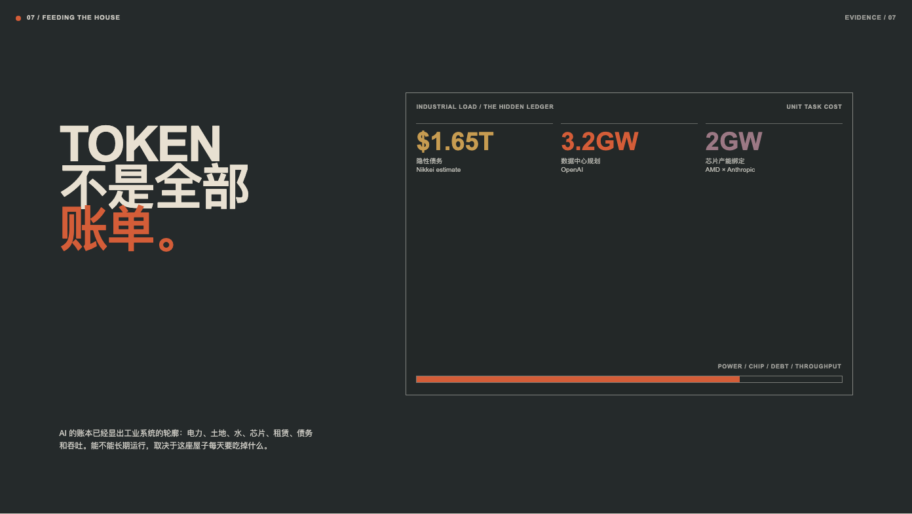
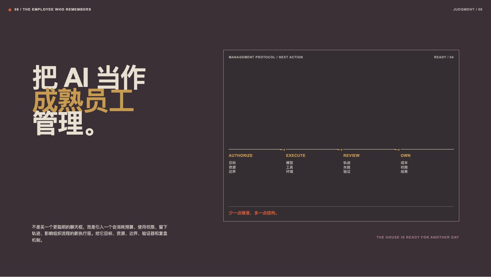

# AI 周报｜The Living Evidence Lab

> 2026.07.21—07.27。把本周新闻看成一间会变形的研究室：模型、harness、成本、轨迹和人的判断共同决定 Agent 能否长程工作。

## 01 / 判断入口

本周真正的主角不是一个模型，而是一座会工作、会记忆、会被审计的屋子。

## 02 / 上下文之门

删掉不是失忆。被移走的是模型读文件、看工具、跑测试就能推断的废说明；真正留下的是偏好、参考、验证流程和判断边界。

## 03 / Agent 的运行时身体

身份、权限、网络出口、可写范围和检查点，决定了 Agent 是否能成为长程执行者。

## 04 / 证据桌

> 生成不是完成，证据才是。

模型提出候选行动，harness 约束环境，验证器打分，轨迹把失败变成下一次行动的材料。

## 05 / 交付物栖息地

AI 产品争夺的不是聊天框，而是离真实交付物最近的位置。

## 06 / 真实工作轨迹

下一轮训练数据红利，更可能来自任务如何被完成、卡住、修正和交付，而不是人们说过什么。

## 07 / 全栈账单

Token 只是账单的一行。电力、土地、水、芯片、租赁、债务和吞吐决定系统能否长期运行。

## 08 / 结论与行动

把 AI 当作成熟员工管理：给它目标、资源、边界、验证器和复盘机制。少一点噪音，多一点结构。

## 来源与事实索引

Anthropic context engineering；OpenAI / Hugging Face security incident；AISI frontier evaluation cheating；UNU Agent Harness framework；Cursor Agent Swarm；Google Tunix；Microsoft MagenticLite；GitHub Copilot Canvases；xAI Grok for Excel；OpenAI Project Camellia；AMD × Anthropic；Nikkei AI hidden debt report。
